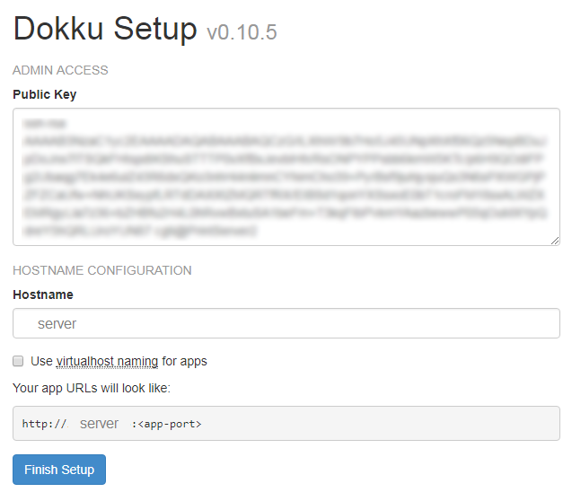

# Lanchonete IFTO

Sistema de gerenciamento da utilização de beneficios destinados à alimentação no campus.


## Como utilizar?
1 Instalando Dokku
```console
wget https://raw.githubusercontent.com/dokku/dokku/v0.10.5/bootstrap.sh
sudo DOKKU_TAG=v0.10.5 bash bootstrap.sh
```

2 Gerar chave ssh (Aceite as três opções pedidas por default. Não inserir password)
```console
ssh-keygen -t rsa
```

3 Visualizar a chave, selecionar e copiar o conteúdo
```console
cat ~/.ssh/id_rsa.pub
```

4 Acessar o endereço IP do servidor pelo navegador, colar a chave copiada e pressionar Finish Setup


5 Criar o app Restaurante
```console
dokku apps:create restaurante
```

6 Instalar plugin mysql, criar serviço e ligar ao app
```console
sudo dokku plugin:install https://github.com/dokku/dokku-mysql.git mysql
dokku mysql:create restaurante
dokku mysql:link restaurante restaurante
```

7 Configurando DEBUG e SECRET_KEY (Criar Secret Key segura)
```console
dokku config:set restaurante DEBUG='False'
dokku config:set restaurante SECRET_KEY='sua secret_key'
```

8 Clone o repositório, no final será apresentado o endereço para acessar a aplicação
```console
sudo dokku plugin:install https://github.com/crisward/dokku-clone.git clone
dokku clone restaurante https://github.com/ricardopimentel/Restaurante.git Restaurante
```

9 Acesse a página de configuração http://servidor:porta/restaurante

- Preencha os dados solicitados e clique em salvar